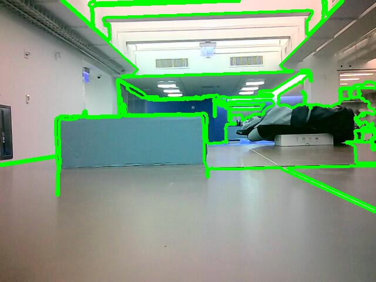
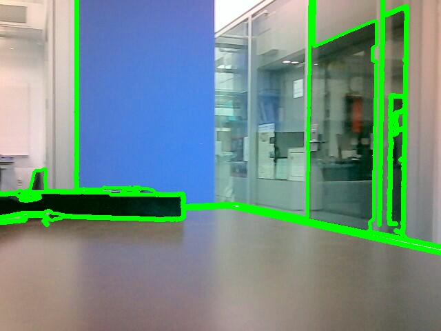
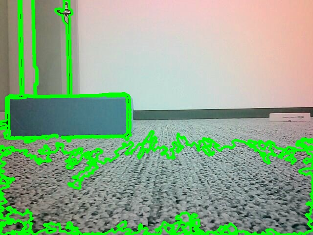

# VIAM Rover Obstacle Avoidance

## Overview
This program is designed to navigate a rover autonomously using its onboard camera. The current implementation relies solely on image processing techniques for obstacle detection and navigation.

## Technical Limitations
The navigation algorithm depends on edge detection from a single camera feed, which presents several limitations:

1. **Depth Perception**: Without stereoscopic vision or depth sensors, the algorithm cannot accurately gauge the distance to objects. It uses contour size as a heuristic to estimate "close" and "far" obstacles, which is not as reliable as true depth information.

2. **Flat Surfaces/Floor Placement**: The algorithm may struggle to identify flat, untextured surfaces as it relies on visible edges to detect obstacles. This can result in the rover not recognizing certain obstacles or terrain features. Placing the rover directly on the floor can cause the edge detection algorithm to pick up carpet textures or other floor irregularities, leading to a high number of false positives for obstacles. We had significant issues with using the rover on the 5th floor carpet of the NYU Data Science building due to this, as shown below.

3. **Variable Lighting**: Changes in lighting can affect edge detection, potentially causing the rover to misidentify obstacles or miss them entirely.

